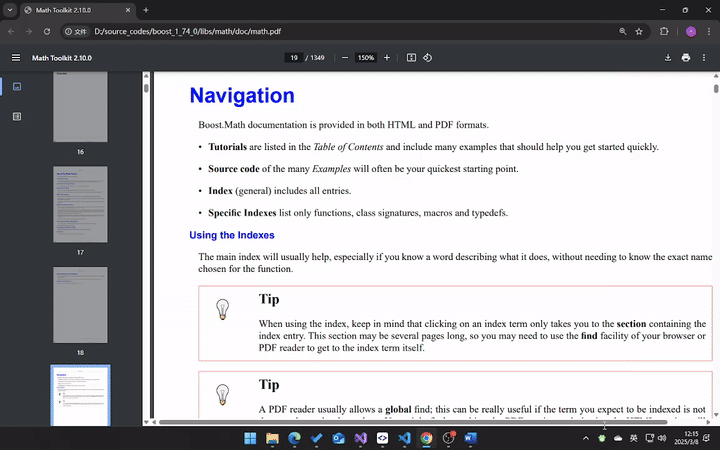

# MouseLineFocus: Focus and Reading Assisting Tool

`MouseLineFocus` is a tool to assist reading and focusing around mouse position on Windows. By overlaying a semi-transparent horizontal/vertical line region, it helps to draw user's attention to specific area.

## Features

- Support horizontal and vertical lines.
- Support opacity customization.
- Support color customization.
- Support reverted mode.
- Support multiple profiles, each configured separately and can switch easily.
- Keyboard shortcuts to common operations.

### Keyboard Shortcuts

- `Ctrl+Shift+T`: Toggle the application on or off.
- `Ctrl+Shift+I`: Toggle the inverted mode.
- `Ctrl+Shift+H`: Toggle horizontal line.
- `Ctrl+Shift+V`: Toggle vertical line.
- `Ctrl+Shift+P`: Switch to previous profile.
- `Ctrl+Shift+N`: Switch to next profile.

## Build

The project is based on `Qt 5.15`, on Windows. It's CMake based, instead of QMake. It should be compiled with little environment setup with ease.

There are sample CMakePresets and CMakeUserPresets located in `docs/sample_cmake_user_presets` for reference. Those are my local used ones.

### 3rd-party Libraries Used

The project uses the following 3rd-party libraries:

- [spdlog](https://github.com/gabime/spdlog)
- Hotkey hook module from Capture2Text. [Link](https://capture2text.sourceforge.net/).
